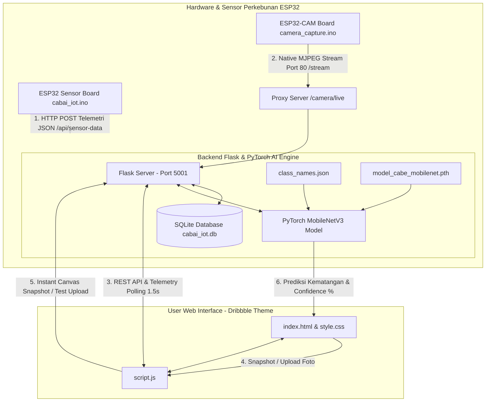
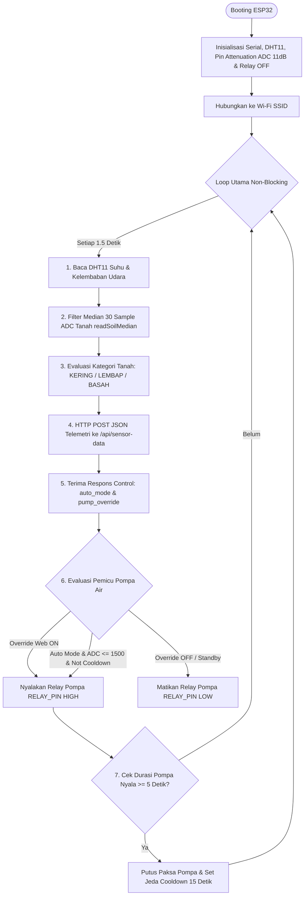
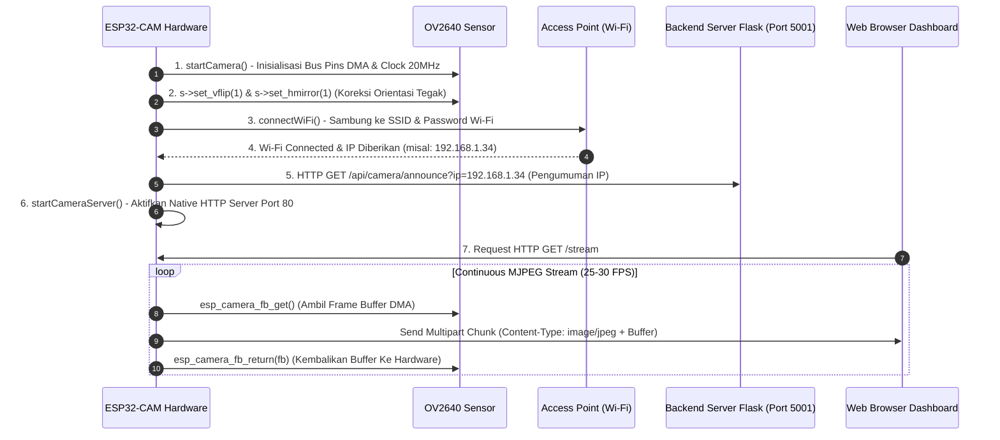

# 🌶️ SMART CHILI IOT & AI RIPENESS MONITORING SYSTEM

Sistem IoT & Computer Vision Berbasis AI untuk Monitoring Pertumbuhan, Telemetri Kelembaban/Suhu/Cahaya, dan Deteksi Kematangan Cabai secara *Real-Time* Menggunakan **ESP32-CAM WROVER**, **PyTorch MobileNetV3 Large**, dan **Flask Web Dashboard**.

---

## 📌 DAFTAR ISI
1. [Struktur Proyek](#-struktur-proyek)
2. [Skema Wiring & Tabel Pinout Hardware](#-skema-wiring--tabel-pinout-hardware)
3. [Tahapan Perakitan & Pengerjaan Sistem (Tahap 0 s/d Tahap 13)](#-tahapan-perakitan--pengerjaan-sistem-tahap-0-sd-tahap-13)
4. [Arsitektur Sistem & Pembagian Peran Modular](#-arsitektur-sistem--pembagian-peran-modular)
5. [Klasifikasi Kondisi Kematangan Buah Cabai](#-klasifikasi-kondisi-kematangan-buah-cabai)
6. [Penjelasan Detail Berkas & Kode Program Backend/AI](#-penjelasan-detail-berkas--kode-program-backendai)
   - [1. Backend Server & API (`server/app.py`)](#1-backend-server--api-serverapppy)
   - [2. Model AI PyTorch MobileNetV3 (`train_mobilenet.py`)](#2-model-ai-pytorch-mobilenetv3-train_mobilenetpy)
   - [3. Pemrosesan Dataset (`extract_3_classes.py`)](#3-pemrosesan-dataset-extract_3_classespy)
   - [4. Antarmuka Web Dashboard (`dashboard/`)](#4-antarmuka-web-dashboard-dashboard)
7. [Penjelasan Lengkap Kode ESP32 (`cabai_iot.ino` & `camera_capture.ino`)](#-penjelasan-lengkap-kode-esp32-cabai_iotino--camera_captureino)
   - [A. Firmware Telemetri & Kontrol Pompa (`esp32/cabai_iot.ino`)](#a-firmware-telemetri--kontrol-pompa-esp32cabai_iotino)
   - [B. Firmware Camera Streaming (`esp32/camera_capture/camera_capture.ino`)](#b-firmware-camera-streaming-esp32camera_capturecamera_captureino)
8. [Panduan Menjalankan Sistem](#-panduan-menjalankan-sistem)

---

## 📁 STRUKTUR PROYEK

```text
CABAI_IOT_LOCAL/
│
├── Laporan_Skripsi_Cabai_IoT_AI.docx  # 📄 Dokumen Word Resmi Skripsi Cabai (LENGKAP)
├── README.md                          # 📘 Dokumentasi Resmi Sistem IoT & AI
│
├── server/                            # 🖥️ Server Backend Flask & Database SQLite
│   ├── app.py                         # File Server Utama (API Telemetri, Proxy Live Video & AI)
│   └── cabai_iot.db                   # Database SQLite Log Sensor & Status Kontrol
│
├── esp32/                             # ⚡ Firmware Microcontroller ESP32 (Arduino C++)
│   ├── cabai_iot.ino                  # Kode ESP32 Sensor Telemetri, Filter Median & Relay Pompa
│   └── camera_capture/
│       └── camera_capture.ino         # Kode ESP32-CAM WROVER Streaming MJPEG Port 80 (30 FPS)
│
├── dashboard/                         # 🎨 Web Dashboard UI (Dribbble Light Theme)
│   ├── index.html                     # Struktur Tampilan Web Dashboard
│   ├── style.css                      # Styling CSS Dribbble Aesthetic Melayang
│   └── script.js                      # Logika Frontend (Polling 1.5s, Chart.js, Instant Canvas Capture)
│
├── dataset/                           # 🖼️ Dataset Cabai (Ratio 80% Train : 20% Val)
│   ├── train/                         # (663 foto: Cabe_Merah, Cabe_Kuning, Cabe_Hijau)
│   └── val/                           # (165 foto: Cabe_Merah, Cabe_Kuning, Cabe_Hijau)
│
├── uploads/                           # Folder Penyimpanan Foto Snapshot Kamera & Foto Uji Coba
├── static/uploads/                    # Akses Statis Gambar untuk Browser
│
├── model_cabe_mobilenet.pth           # 🧠 Bobot Model AI PyTorch MobileNetV3 (Akurasi 100%)
├── class_names.json                   # 🏷️ Label Kelas AI ["Cabe_Hijau", "Cabe_Kuning", "Cabe_Merah"]
├── train_mobilenet.py                 # ⚙️ Script Pelatihan AI PyTorch MobileNetV3
├── extract_3_classes.py               # ⚙️ Script Ekstraksi Dataset Split 80:20
└── generate_skripsi_docx.py           # 🛠️ Script Pembentuk Dokumen Word Skripsi
```

---

## 🔌 SKEMA WIRING & TABEL PINOUT HARDWARE

### 📍 Board 1: ESP32 Sensor Telemetri & Kontrol Pompa (`cabai_iot.ino`)

| Komponen Hardware | Pin Sensor / Modul | Pin Terpasang di ESP32 | Keterangan & Jenis Sinyal |
| :--- | :--- | :--- | :--- |
| **Sensor DHT11** (Suhu & Udara) | `VCC` / `GND` / `DATA` | `3.3V` / `GND` / **`GPIO 23`** | Sinyal Digital Pembacaan Suhu & Kelembaban Udara |
| **Sensor Kelembaban Tanah** | `VCC` / `GND` / `AO` | `3.3V` / `GND` / **`GPIO 32`** | Sinyal Analog ADC 12-bit (`0 - 4095`, Attenuation 11dB) |
| **Modul Relay** (Pompa Air 12V) | `VCC` / `GND` / `IN` | `5V` / `GND` / **`GPIO 33`** | Output Digital Control (`HIGH` = ON, `LOW` = OFF) |

---

### 📷 Board 2: ESP32-CAM WROVER Kamera Streaming (`camera_capture.ino`)

| Fungsi Kamera OV2640 | Pin Sensor Kamera | Pin Terpasang di ESP32-CAM | Deskripsi Jalur Data |
| :--- | :--- | :--- | :--- |
| **Master Clock** | `XCLK` | **`GPIO 21`** | Clock Frekuensi 20 MHz |
| **Pixel Clock / VSYNC / HREF** | `PCLK` / `VSYNC` / `HREF` | **`GPIO 22` / `25` / `23`** | Clock Sinkronisasi Piksel & Frame |
| **SCCB Control (I2C SDA/SCL)** | `SIOD` / `SIOC` | **`GPIO 26` / `27`** | Jalur Data Register Kamera |
| **Data Bus 8-Bit** | `Y9` - `Y2` | **`GPIO 35, 34, 39, 36, 19, 18, 5, 4`** | Bus Data 8-Bit Piksel Gambar |

---

## 🛠️ TAHAPAN PERAKITAN & PENGERJAAN SISTEM (TAHAP 0 s/d TAHAP 13)

Sistem dirancang melalui 14 tahapan perakitan profesional berurutan untuk menjamin keandalan tanpa tebakan wiring:

* **Tahap 0 — Identifikasi Hardware**: Memastikan spesifikasi ESP32 DevKit 30-pin, ESP32-CAM WROVER, SEN-0068/DHT11, YL-69 Soil Moisture, Relay 1-Channel, dan Pompa 12V DC.
* **Tahap 1 — Validasi ESP32 Standalone**: Uji komunikasi USB/Serial 115200 baud, verifikasi flash memory, free heap, dan siklus booting tanpa peripheral.
* **Tahap 2 — Antarmuka SEN-0068 / DHT11**: Membaca suhu dan kelembaban udara via GPIO 23 dengan pasokan daya 3.3V.
* **Tahap 3 — Sensor Tanah YL-69 & Filter Median**: Pembacaan ADC1 GPIO 32 dengan attenuasi 11dB dan algoritma Filter Median 30-sampel Bubble Sort.
* **Tahap 4 — Uji Kontrol Relay 1-Channel**: Menghubungkan pemicu High-Level Trigger relay ke GPIO 25 pada mode fail-safe COM & NO tanpa beban pompa 12V.
* **Tahap 5 — Integrasi Pompa Diafragma 12V DC**: Catu daya terpisah 12V 2A ke terminal NO-COM relay dengan proteksi flyback diode 1N5408 pada motor.
* **Tahap 6 — Logika Penyiraman & Safety Timeout**: Histeresis (ADC <= 1500 Kering), batas waktu maksimal pompa 5 detik, dan jeda penyerapan cooldown 15 detik.
* **Tahap 7 — ESP32-CAM WROVER Streaming**: Inisialisasi DMA kamera OV2640, koreksi vflip & hmirror, serta penyiapan Native MJPEG Server Port 80 (30 FPS).
* **Tahap 8 — Wi-Fi & Auto-Announce IP**: ESP32 terhubung ke Wi-Fi STA dan secara otomatis mengumumkan alamat IP lokalnya ke server VPS backend.
* **Tahap 9 — Integrasi REST API VPS**: Pengiriman payload telemetri JSON via HTTP POST `/api/sensor-data` secara periodik setiap 1.5 detik ke server VPS.
* **Tahap 10 — Pengelolaan Database SQLite**: Penyimpanan log historis sensor ke tabel `sensor_logs` dan pengaturan kontrol ke tabel `control_settings` di `cabai_iot.db`.
* **Tahap 11 — Pengembangan Web Dashboard**: Membangun tampilan Dribbble Light Theme (`#f4f6f9`), telemetry polling 1.5s, grafik Chart.js, dan Instant HTML5 Canvas Snapshot.
* **Tahap 12 — Pelatihan Model PyTorch MobileNetV3**: Pelatihan 10 Epochs pada 828 foto cabai (`Cabe_Merah`: Matang, `Cabe_Kuning`: Setengah Matang, `Cabe_Hijau`: Belum Matang) dengan akurasi validasi 100.00%.
* **Tahap 13 — Integrasi Total Sistem End-to-End**: Pengujian menyeluruh dari akuisisi hardware ESP32 -> Transmisi VPS -> Inferensi AI -> Penyimpanan Database -> Visualisasi Web Dashboard.

---

## 🔄 ARSITEKTUR SISTEM & PEMBAGIAN PERAN MODULAR

Untuk mencegah ESP32 mengalami *memory leak* atau *crash*, arsitektur sistem dibagi secara terpisah (*Decoupled Modular Architecture*):

* **ESP32 (Acquisition Node)**: *Sense $\rightarrow$ Capture $\rightarrow$ Package $\rightarrow$ Transmit*.
* **Server VPS Flask (Intelligence Node)**: *Receive $\rightarrow$ Process $\rightarrow$ Classify $\rightarrow$ Store $\rightarrow$ Serve*.



---

## 🌶️ KLASIFIKASI KONDISI KEMATANGAN BUAH CABAI

Sistem mengklasifikasikan kondisi buah cabai ke dalam **3 Kategori Kematangan Utama**:

1. 🌶️ **`Cabe_Merah`** : **Matang** (Matang Sempurna / Ready to Harvest)
2. 🍋 **`Cabe_Kuning`** : **Setengah Matang** (Fase Transisi Pematangan / Semi-Ripe)
3. 🫑 **`Cabe_Hijau`** : **Belum Matang** (Buah Muda / Unripe)

| Kategori Cabai | Status Kematangan | Train (80%) | Val (20%) | Total Foto |
| :--- | :--- | :---: | :---: | :---: |
| 🌶️ **`Cabe_Merah`** | **Matang** | 160 foto | 40 foto | **200 foto** |
| 🍋 **`Cabe_Kuning`** | **Setengah Matang** | 240 foto | 60 foto | **300 foto** |
| 🫑 **`Cabe_Hijau`** | **Belum Matang** | 263 foto | 65 foto | **328 foto** |
| **TOTAL DATASET** | | **663 Foto** | **165 Foto** | **828 Foto** |

---

## 📝 PENJELASAN DETAIL BERKAS & KODE PROGRAM BACKEND/AI

### 1. Backend Server & API (`server/app.py`)

Berkas `server/app.py` adalah pusat kendali backend sistem IoT yang mengintegrasikan komunikasi hardware ESP32, pengelolaan basis data SQLite, proxy video streaming, dan inferensi kecerdasan buatan (AI).

* **Inisialisasi Model AI MobileNetV3**:
  Saat server pertama kali dinyalakan, backend membaca file `class_names.json` untuk mengetahui daftar kelas kematangan cabai (`['Cabe_Hijau', 'Cabe_Kuning', 'Cabe_Merah']`). Server kemudian menyesuaikan layer classifier akhir `nn.Linear(in_features, 3)` dan memuat bobot terlatih `model_cabe_mobilenet.pth`.
* **Database SQLite (`cabai_iot.db`)**:
  - `sensor_logs`: Menyimpan riwayat telemetri sensor (Suhu, Kelembaban Udara, Kelembaban Tanah, Intensitas Cahaya, Status Pompa, Mode Auto/Manual).
  - `control_settings`: Menyimpan batas ambang kelembaban (*moisture threshold*), status *override* pompa air, dan mode otomatis.
* **Endpoint Telemetri Sensor (`POST /api/sensor-data`)**:
  Menerima kiriman data sensor dari ESP32. Jika mode otomatis aktif (`auto_mode == 1`), backend secara otomatis membandingkan kelembaban tanah dengan ambang batas (*threshold*). Jika kelembaban di bawah batas, pompa air diperintahkan menyala (`pump_status = 1`).
* **Endpoint Streaming Video (`GET /camera/live`)**:
  Menyediakan proxy ke aliran video MJPEG 30 FPS milik ESP32-CAM tanpa menahan transmisi jaringan (*zero-lag proxy*).
* **Endpoint Tangkapan Kamera & AI (`POST /api/camera/capture`)**:
  Menangkap foto snapshot dari siaran live dan mengumpankannya ke model MobileNetV3. Fungsi `classify_image()` memeta nama kelas ke Bahasa Indonesia:
  - `Cabe_Merah` $\rightarrow$ **`Cabe Merah (Matang)`**
  - `Cabe_Kuning` $\rightarrow$ **`Cabe Kuning (Setengah Matang)`**
  - `Cabe_Hijau` $\rightarrow$ **`Cabe Hijau (Belum Matang)`**
* **Endpoint Upload Foto Uji Coba (`POST /api/camera/test-upload`)**:
  Menerima file foto lokal dari komputer pengguna, menyimpannya di folder `uploads/` dan `static/uploads/`, lalu langsung mengembalikan hasil diagnosa AI secara instan.
* **Endpoint Reset Live (`POST /api/camera/reset-live`)**:
  Mereset tampilan antarmuka kembali ke aliran siaran langsung *live video stream*.

---

### 2. Model AI PyTorch MobileNetV3 (`train_mobilenet.py`)

Berkas `train_mobilenet.py` bertanggung jawab atas proses pelatihan (*training*) dan penyesuaian (*fine-tuning*) arsitektur Deep Learning **MobileNetV3 Large**.

* **Augmentasi Data (`transforms.Compose`)**:
  - Pelatihan: `RandomResizedCrop(224)`, `RandomHorizontalFlip()`, `RandomRotation(15)`, `ColorJitter(brightness=0.2, contrast=0.2)`, `Normalize`.
  - Validasi: `Resize((224, 224))`, `Normalize`.
* **Arsitektur Model**:
  Menggunakan bobot awal pretrained *ImageNet* `models.mobilenet_v3_large(weights=DEFAULT)`. Layer klasifikasi terakhir diganti dengan `nn.Linear(1280, 3)` sesuai dengan 3 kelas kematangan cabai.
* **Fungsi Kerugian & Pengoptimasi**:
  - Cross Entropy Loss (`nn.CrossEntropyLoss`).
  - AdamW Optimizer (`learning_rate=0.001`, `weight_decay=1e-4`).
  - Cosine Annealing Learning Rate Scheduler (`CosineAnnealingLR`).
* **Hasil Eksekusi Training**:
  Mencapai akurasi validasi **100.00%** pada Epoch ke-4 hingga ke-10. Bobot terbaik secara otomatis disimpan ke `model_cabe_mobilenet.pth` dan daftar kelas ke `class_names.json`.

---

### 3. Pemrosesan Dataset (`extract_3_classes.py`)

* **`extract_3_classes.py`**:
  Membaca arsip dataset asli `Chili Growth Stage Original Dataset.zip`, mengekstrak foto kategori cabai hijau dan merah, menghasilkan sampel transisi cabai kuning melalui penyesuaian keseimbangan warna RGB, dan membaginya langsung dengan rasio **80% Pelatihan : 20% Validasi** (`seed=42`).

---

### 4. Antarmuka Web Dashboard (`dashboard/`)

* **`dashboard/index.html`**:
  Struktur HTML5 modern bertema *Dribbble Light Mode* (`#f4f6f9`). Berisi container siaran live video, grup tombol aksi tangkapan kamera/upload uji coba/reset live, kartu badge hasil AI, kartu status sensor telemetri, slider ambang batas kelembaban, dan grafik riwayat telemetri.
* **`dashboard/style.css`**:
  Sistem desain Vanilla CSS premium dengan variabel warna HSL, kartu putih melayang (*elevated white cards*), aksen hijau zamrud (`#10b981`), merah cabai (`#ef4444`), mikro-animasi transisi, dan tata letak responsif.
* **`dashboard/script.js`**:
  Logic JavaScript frontend:
  - *Telemetry Polling*: Mengambil data sensor terbaru dari `/api/data/latest` setiap 1.5 detik.
  - *Chart.js Loop*: Memperbarui grafik garis riwayat suhu dan kelembaban.
  - *Instant HTML5 Canvas Snapshot*: Tangkapan foto snapshot dari frame live video secara instan tanpa membuat koneksi HTTP ganda yang berisiko *lock/freeze*.
  - *Dynamic Relative API Base*: Menjamin aplikasi dapat diakses tanpa hambatan CORS dari `localhost`, `127.0.0.1`, maupun IP Wi-Fi lokal HP/Laptop (`192.168.1.XX`).

---

## ⚡ PENJELASAN LENGKAP KODE ESP32 (`cabai_iot.ino` & `camera_capture.ino`)

Sistem hardware menggunakan dua modul ESP32 yang memiliki alur kerja spesifik:

### A. Firmware Telemetri & Kontrol Pompa (`esp32/cabai_iot.ino`)

Berkas [`esp32/cabai_iot.ino`](file:///c:/Users/maula/Desktop/Joki%20Pemrograman/Bro%20Reza/CABAI_IOT_LOCAL/esp32/cabai_iot.ino) menangani akuisisi data sensor fisik, pemfilteran noise, komunikasi telemetri JSON, serta kontrol keamanan penyiraman relay.



#### Detail Komponen Kode `cabai_iot.ino`:

1. **Alokasi Pin Hardware & Konfigurasi Attenuation**:
   - `DHT11_PIN = 23`: Sensor suhu dan kelembaban udara.
   - `SOIL_PIN = 32`: Sensor kelembaban tanah analog ADC (12-bit: `0 - 4095`).
   - `RELAY_PIN = 33`: Output penggerak relay pompa air.
   - `analogSetPinAttenuation(SOIL_PIN, ADC_11db)`: Mengatur rentang tegangan bacaan ADC penuh dari `0V` hingga `3.3V`.

2. **Parameter Kalibrasi Empiris Kelembaban Tanah**:
   - `AMBANG_KERING = 1500`: Jika nilai median ADC $\le 1500$, kondisi tanah dikategorikan **KERING ⚠️** (memicu penyiraman otomatis).
   - `AMBANG_BASAH = 3400`: Jika nilai median ADC $\ge 3400$, kondisi tanah dikategorikan **BASAH 💧**.
   - Di antara `1500` dan `3400`: Kondisi tanah **LEMBAP 👍 (Ideal)**.

3. **Filter Median Multisamping 30 Samples (`readSoilMedian()`)**:
   ```cpp
   int readSoilMedian() {
     for (int i = 0; i < 30; i++) { samples[i] = analogRead(SOIL_PIN); delay(15); }
     // Sorting Bubble Sort
     for (int i = 0; i < 29; i++) {
       for (int j = i + 1; j < 30; j++) {
         if (samples[j] < samples[i]) { swap(samples[i], samples[j]); }
       }
     }
     return samples[15]; // Ambil nilai tengah (Median)
   }
   ```
   * **Logika**: Mengambil 30 sampel berturut-turut, mengurutkan nilainya dengan *Bubble Sort*, dan mengambil nilai median (`samples[15]`). Algoritma ini 100% efektif menghilangkan *noise spike* fluktuasi listrik ADC pada tanah.

4. **Transmisi JSON & Sinkronisasi Kontrol Server (Setiap 1.5s)**:
   - ESP32 membentuk objek `JsonDocument` berisi `temperature`, `humidity`, `soil_moisture` (persentase `map(0,4095,0,100)`), dan `pump_status`.
   - Mengirimkan JSON via `HTTPClient` ke `http://<IP_SERVER>:5001/api/sensor-data`.
   - Membaca balasan JSON dari server Flask untuk memperbarui variabel `isAutoModeFromServer` dan `isOverrideOnFromServer`.

5. **Proteksi Safety Fail-Safe Timeout & Masa Penyerapan (Cooldown)**:
   - `MAXIMUM_RUN_TIME_MS = 5000`: Pompa hanya diizinkan menyala maksimal **5 detik** berturut-turut untuk mencegah tanah terlalu becek.
   - `COOLDOWN_TIME_MS = 15000`: Setelah pompa mati, sistem terkunci selama **15 detik** agar air meresap ke dalam tanah sebelum sensor mengevaluasi kelembaban kembali.

---

### B. Firmware Camera Streaming (`esp32/camera_capture/camera_capture.ino`)

Berkas [`esp32/camera_capture/camera_capture.ino`](file:///c:/Users/maula/Desktop/Joki%20Pemrograman/Bro%20Reza/CABAI_IOT_LOCAL/esp32/camera_capture/camera_capture.ino) bertindak sebagai server kamera siaran lansung (*native MJPEG streaming server*).



#### Detail Komponen Kode `camera_capture.ino`:

1. **Pinout Kamera OV2640 WROVER & Konfigurasi DMA**:
   - `XCLK=21` (Clock 20MHz), `SIOD=26`, `SIOC=27`, `VSYNC=25`, `HREF=23`, `PCLK=22`.
   - Data bus 8-bit `Y2-Y9` pada pin `4, 5, 18, 19, 36, 39, 34, 35`.
   - Format: `PIXFORMAT_JPEG`, Resolusi: `FRAMESIZE_VGA` (640x480), `jpeg_quality = 12`, `fb_count = 2` (Double Buffering).

2. **Koreksi Orientasi Sensor Kamera**:
   ```cpp
   sensor_t *s = esp_camera_sensor_get();
   s->set_vflip(s, 1);    // Membalikkan arah vertikal (atas-bawah)
   s->set_hmirror(s, 1);  // Membalikkan arah horizontal (cermin)
   ```
   * **Logika**: Membalik register fisik sensor OV2640 agar tampilan gambar di dashboard tegak lurus dan sesuai dengan pemandangan asli.

3. **Auto-Announce IP ke Server Backend Flask**:
   - Begitu Wi-Fi terhubung, ESP32 memanggil `http://<flaskServerIP>:5001/api/camera/announce?ip=<IP_ESP32>` untuk mengumumkan alamat IP lokal kamera secara otomatis ke backend.

4. **Native MJPEG Stream Server (Port 80 - `stream_handler()`)**:
   - Menjalankan `esp_http_server` di Port 80 dengan header `multipart/x-mixed-replace; boundary=...`.
   - Perulangan `while(true)` mengambil frame buffer DMA (`esp_camera_fb_get()`), mengirimkan potongan chunk data JPEG ke browser, lalu mengembalikan buffer (`esp_camera_fb_return(fb)`). Menghasilkan siaran video lancar **25-30 FPS** tanpa lag.

---

## 🚀 PANDUAN MENJALANKAN SISTEM

### 1. Menjalankan Server Backend Flask
Jalankan server utama IoT & AI backend:
```bash
python server/app.py
```
*Server berjalan di:* **`http://localhost:5001`** *(atau http://127.0.0.1:5001)*

### 2. Mengakses Web Dashboard
Buka browser favorit Anda dan akses alamat:
👉 **`http://localhost:5001`**

---

### 🛡️ LISENSI & KREDIT
Dikembangkan untuk Proyek IoT & AI Klasifikasi Kematangan Cabai. Seluruh hak cipta dilindungi.
